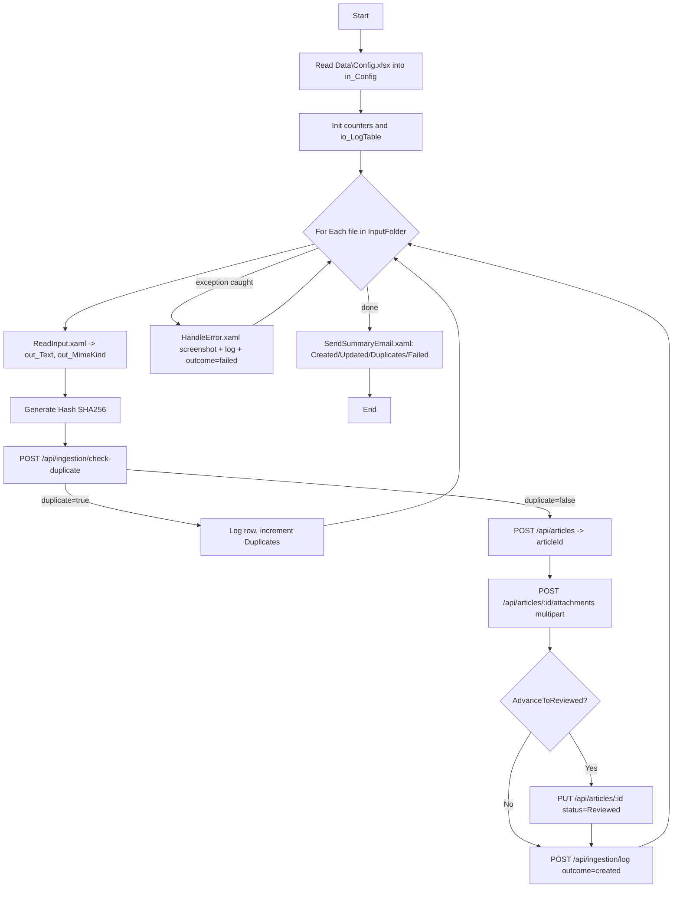

# Scenario 1 — DHL SmartHub: deliverables & assignment mapping

This document supports **Project Management (10%)**, **Web (50%)**, and **RPA design (40%)** reporting for *AI‑Powered Knowledge Base Automation*.

---

## 1. Project management & progress (10%)

### Iteration plan

| Week | Milestone | Done? | Notes |
|------|-----------|-------|-------|
| 1 | MySQL schema + Express CRUD | ☑ | `database/schema.sql`, `backend/` |
| 2 | React + router + API service | ☑ | `frontend/`, `src/services/api.js` |
| 3 | Tags + filters + UiPath POST sample | ☑ | Form POST, `rpa/input` sample |
| 4 | Status history (Draft→Reviewed→Published) + creator/date filters | ☑ | Migration `002`, Viewer history modal |
| 5 | Attachments + ingestion API + Draft Builder + UiPath project | ☑ | Migration `003`, `rpa/SmartHubBot/` |
| 6 | Demo recording + report | ☐ | Screen capture + RPA run video |

### Risks / mitigations

| Risk | Mitigation |
|------|------------|
| MySQL auth (`ER_ACCESS_DENIED`) | `backend/.env` loaded via `env.js` from the `backend/` folder. |
| UiPath JSON serialization quirks | All POSTs accept `application/x-www-form-urlencoded` (no JSON escaping needed in Studio). |
| Scope creep on GPT/LLM | 5.3 implemented offline (deterministic **Draft Builder**) so we are not blocked on an API key — same JSON shape can be served by a real LLM later. |
| File uploads break demo | `multer` saves to `backend/uploads/` (gitignored); 20 MB cap; download URL exposed via API. |
| RPA email step requires SMTP creds | Fallback documented: write `Logs/summary-YYYYMMDD.html` to disk so the recorded demo still shows the summary. |

---

## 2. Web application — requirement checklist (50%)

| Requirement | Implementation |
|-------------|----------------|
| Modern stack (React) | Vite + React 19 |
| Interactive UI + events | Forms, filters, modals, buttons, debounced conflict lookup |
| JS logic | Hooks, fetch, state; deterministic `proposeDraft()` helper |
| Forms + validation | Login (min lengths), Upload (text or files required), date `YYYY-MM-DD` on API, status enum |
| Navigation | `react-router-dom`: `/login`, `/upload`, `/viewer` |
| JSON REST, no hardcoded lists | All article / tag / user / attachment data from API |
| CRUD | Articles + attachments + ingestion log; tags GET; users GET |
| DB-backed | MySQL via `mysql2` pool |
| Secured access (baseline) | Mock session + protected Upload + per-row API actions; production hardening = bcrypt vs `password_hash` |
| Upload console (text + PDF + DOCX) | Text + file picker; **files now stored server-side** + downloadable from Viewer |
| Draft + status | Default **Draft**; transitions **Reviewed** / **Published**, recorded in `article_status_history` |
| Viewer searchable & filterable | Client search; API filters: status, tag, **creator**, **updated date range**; **Open** modal shows content + attachments |
| Versioning / status history | `GET /api/articles/:id/history` + modal in Viewer |
| Creator stored | `creator_id` FK + `creator_username` join on list/detail |
| **AI-style Draft Builder (5.3)** | `proposeDraft()` — derives Title, Summary, Steps, Tags, Related Links + flags short / confidential / unstructured input |
| **Conflict warnings (5.3)** | Debounced `GET /api/articles/conflicts?title=…` from the title input |
| **Server-side file attachments** | `POST /api/articles/:id/attachments` (multipart), `GET … /download`, list on detail modal |

---

## 3. RPA component (40%) — `rpa/SmartHubBot/`

A real Studio project skeleton lives in **`rpa/SmartHubBot/`**:

```
rpa/SmartHubBot/
├── project.json              # UiPath descriptor (24.10 packages: System, UIAutomation, Excel, Mail, WebAPI)
├── Main.xaml                 # Orchestrator scaffold (variables + comments)
├── Workflows/
│   ├── ReadInput.md          # .txt / .pdf / .docx / image branch logic
│   ├── CheckDuplicate.md     # SHA-256 + POST /api/ingestion/check-duplicate
│   ├── CreateArticle.md      # POST /api/articles + multipart attachment upload
│   ├── UpdateStatus.md       # PUT /api/articles/:id (status + actor_user_id)
│   ├── HandleError.md        # Screenshot + line log + POST /api/ingestion/log (outcome=failed)
│   └── SendSummaryEmail.md   # SMTP body + log + ProcessingLog attached
├── Data/
│   ├── Config.xlsx.template.md
│   └── ProcessingLog.xlsx.template.md
├── Inputs/                   # 3 sample messy files (Teams export, email, handwritten note)
└── README.md                 # End-to-end run instructions
```

### Workflow diagram (Mermaid)



### Automation logic (narrative for the report)

The robot starts by loading **`Data/Config.xlsx`** so the same project runs against dev / UAT / prod without code changes. It iterates files in the watched folder (replace with **Google Drive → Download File** for the real Drive integration). Each iteration is wrapped in its own **Try/Catch** so one bad file never aborts the run.

For each file: extract text with the right activity for its extension; compute the **SHA-256** of the text; call **`/api/ingestion/check-duplicate`**. If the server reports a match within the last 14 days, increment the *Duplicates* counter and continue. Otherwise call **`/api/articles`** to create a `Draft`, then upload the original file via **`/api/articles/:id/attachments`** as multipart. Optionally the bot advances the article to `Reviewed` (recorded in `article_status_history` with the bot's `actor_user_id`).

Every iteration writes a row to **`ProcessingLog.xlsx`** *and* posts to **`/api/ingestion/log`** so the server-side audit trail mirrors the local Excel. The Catch branch (`HandleError.xaml`) takes a **screenshot**, appends to the daily `.log`, and increments the *Failed* counter. The very last activity (`SendSummaryEmail.xaml`) emails the admin a four-cell HTML summary with the log + Excel attached.

---

## 4. Optional items (Section 5.3)

| Item | Status |
|------|--------|
| **GPT-style Draft Builder** | **Implemented offline** as `frontend/src/services/draftBuilder.js` — same JSON shape as a real LLM call; click *Propose draft* in the Upload console. |
| **Conflict / outdated alerts** | **Implemented** — `GET /api/articles/conflicts` + warning banner in Upload console. |
| **OCR for PNG/JPG via GPT** | Documented in `Workflows/ReadInput.md` (case `image`). Plug in **UiPath OmniPage OCR** or **Read PDF With OCR** to enable in Studio. |

---

## 5. Database migrations (run order)

```text
mysql -u root -p < database/schema.sql
mysql -u root -p dhl_kb < database/seed.sql
# Existing DBs that pre-date status history:
mysql -u root -p dhl_kb < database/migrations/002_article_status_history.sql
# Existing DBs that pre-date attachments / ingestion:
mysql -u root -p dhl_kb < database/migrations/003_ingestion_and_attachments.sql
```

Fresh installs only need `schema.sql` + `seed.sql` — both tables are already in the base schema.

---

## 6. API quick reference

| Method | Path | Purpose |
|--------|------|---------|
| GET | `/api/health` | Liveness |
| GET | `/api/articles` | List + query: `status`, `tag`, `creator_id`, `updated_from`, `updated_to` |
| POST | `/api/articles` | Create draft (JSON or `application/x-www-form-urlencoded` with `tags`) |
| GET | `/api/articles/conflicts?title=…&tag=…` | Reviewed / Published articles with overlapping title tokens |
| GET | `/api/articles/:id` | Article detail (+ `creator_username`, `tags`, `attachments`) |
| GET | `/api/articles/:id/history` | Status audit trail |
| PUT | `/api/articles/:id` | Update fields; on status change inserts history row with `actor_user_id` |
| DELETE | `/api/articles/:id` | Remove article (cascades to tags, history, attachments) |
| GET | `/api/articles/:id/attachments` | List attachments |
| POST | `/api/articles/:id/attachments` | **Multipart upload**, field `files` (up to 8 × 20 MB) |
| GET | `/api/articles/:id/attachments/:attId/download` | Streamed file download |
| DELETE | `/api/articles/:id/attachments/:attId` | Remove attachment |
| POST | `/api/ingestion/check-duplicate` | RPA: SHA-256 lookback (default 14 days) |
| POST | `/api/ingestion/log` | RPA: append run event (created / duplicate / failed / updated) |
| GET | `/api/ingestion/recent?limit=20` | Latest RPA events for admins |
| GET | `/api/tags` | Tag directory |
| GET | `/api/users` | Editors for filter dropdown |

---

## 7. Run cheat-sheet (for the demo recording)

```powershell
# 1. Database
mysql -u root -p < database/schema.sql
mysql -u root -p dhl_kb < database/seed.sql

# 2. Backend (creates backend\uploads\ on first attachment)
cd backend
npm install
npm run dev       # http://localhost:3001

# 3. Frontend
cd ..\frontend
npm install
npm run dev       # http://localhost:5173

# 4. UiPath
# Open rpa\SmartHubBot\project.json in UiPath Studio.
# Fill Data\Config.xlsx (sheet "settings") — at minimum InputFolder + ApiBaseUrl.
# Drop sample files from rpa\SmartHubBot\Inputs\ into InputFolder, then Run Main.xaml.
```

After the bot finishes:

1. Browser → **Viewer** → see new drafts with tags, **Open** to preview content + download attachments.
2. Browser → **History** modal → audit trail with `Draft → Reviewed (bot)` if `AdvanceToReviewed=True`.
3. Disk → `Logs/run-YYYYMMDD.log` + `Logs/screenshots/` for any failures.
4. Email inbox → summary message with counters and logs attached.

---

*Aligned with the SmartHub repository state including: status history (mig 002), attachments + ingestion log (mig 003), draft builder, conflict alerts, and the SmartHubBot UiPath project.*
