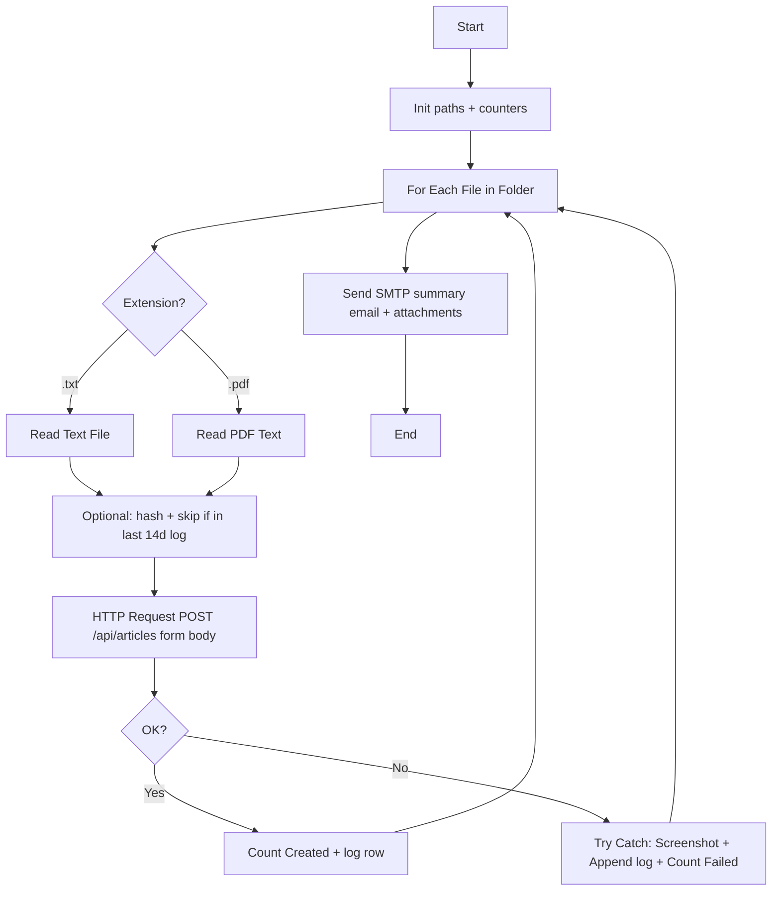

# Scenario 1 — DHL SmartHub: deliverables & assignment mapping

This document supports **Project Management (10%)**, **Web (50%)**, and **RPA design (40%)** reporting for *AI-Powered Knowledge Base Automation*.

---

## 1. Project management & progress (10%)

### Suggested tracking (copy to Excel / Planner / Notion)

| Week | Milestone | Done? | Notes |
|------|-----------|-------|-------|
| 1 | MySQL schema + Express CRUD | ☐ | `database/schema.sql`, `backend/` |
| 2 | React + router + API service | ☐ | `frontend/`, `src/services/api.js` |
| 3 | Tags + filters + UiPath POST | ☐ | Form POST, `rpa/input` sample |
| 4 | Status history + creator/date filters | ☐ | Migration `002`, Viewer |
| 5 | Demo video + report | ☐ | Screen recording |

### Risks / mitigations

| Risk | Mitigation |
|------|------------|
| MySQL auth (`ER_ACCESS_DENIED`) | `backend/.env` + `env.js` loads from `backend/` folder |
| UiPath JSON errors | Use `application/x-www-form-urlencoded` body |
| Scope creep (GPT) | Mark section 5.3 as **future work** unless required |

---

## 2. Web application — requirement checklist (mandatory)

| Requirement | Implementation |
|-------------|----------------|
| Modern stack (React) | Vite + React 19 |
| Interactive UI + events | Forms, filters, modals, buttons |
| JS logic | `hooks`, `fetch`, state in components |
| Forms + validation | Login (min lengths), Upload (required text/files), date `YYYY-MM-DD` on API |
| Navigation | `react-router-dom`: `/login`, `/upload`, `/viewer` |
| JSON REST, no hardcoded lists | All article/tag/user data from API |
| CRUD | Articles: GET/POST/PUT/DELETE; tags GET; users GET |
| DB-backed | MySQL via `mysql2` pool |
| Secured access (baseline) | Mock session + protected Upload; **production would add server-side auth** |
| Upload console (text + PDF + DOCX) | Text + file picker; content + filenames sent to API (server-side binary parsing = optional extension) |
| Draft + status | `Draft` default; transitions **Reviewed** / **Published** |
| Viewer searchable & filterable | Search (client); filters: status, tag, **creator**, **updated date range** (API) |
| Versioning / status history | `article_status_history` + **Status history** modal + `GET /api/articles/:id/history` |
| Creator stored | `creator_id` on articles; `GET /api/users` + `creator_username` on list/detail |

---

## 3. RPA (UiPath) — workflow diagram (text / Mermaid)

**Goal:** Folder watch → read file → (optional duplicate hash + Excel log per your Studio build) → **POST** article → optional status update → logs + email.

**Automation logic (short narrative)**  
The robot simulates “Drive sync” using a **local folder**. For each new supported file it extracts text, optionally deduplicates using a **hash** compared to **`ProcessingLog.xlsx`**, then creates a **Draft** in SmartHub via the **REST API** (same contract as the web app). Editors complete review in the **Viewer**; the robot may later call **PUT** to advance status if you add that sequence. **Try/Catch** captures failures with **screenshots** and **log files**; a final **email** reports counts (**Created / Failed / Duplicates skipped**).

---

## 4. Optional items (Section 5.3)

| Item | Status |
|------|--------|
| GPT summarization / Draft Builder | Not implemented — document as **future enhancement** |
| Conflict / outdated alerts | Not implemented |
| OCR for PNG/JPG via GPT | Not implemented |

---

## 5. Database migrations (run order)

1. `database/schema.sql` — base tables (includes `article_status_history` on fresh install).
2. `database/seed.sql` — sample tags + optional dev user.
3. **Existing DBs** created before history table:  
   `mysql -u root -p dhl_kb < database/migrations/002_article_status_history.sql`

After migration, **new** articles get an initial **Draft** history row; **status changes** append rows with `actor_user_id` when the Viewer sends it.

---

## 6. API quick reference

| Method | Path | Purpose |
|--------|------|---------|
| GET | `/api/health` | Liveness |
| GET | `/api/articles` | List + query: `status`, `tag`, `creator_id`, `updated_from`, `updated_to` |
| POST | `/api/articles` | Create draft (+ optional `tags` / `tag_list`) |
| GET | `/api/articles/:id` | Article detail (+ `creator_username`, `tags`) |
| GET | `/api/articles/:id/history` | Status audit trail |
| PUT | `/api/articles/:id` | Update fields; body may include `actor_user_id` on status change |
| DELETE | `/api/articles/:id` | Remove article |
| GET | `/api/tags` | Tag directory |
| GET | `/api/users` | Editors for filter dropdown |

---

*Last updated to align with Scenario 1 SmartHub MVP in this repository.*
